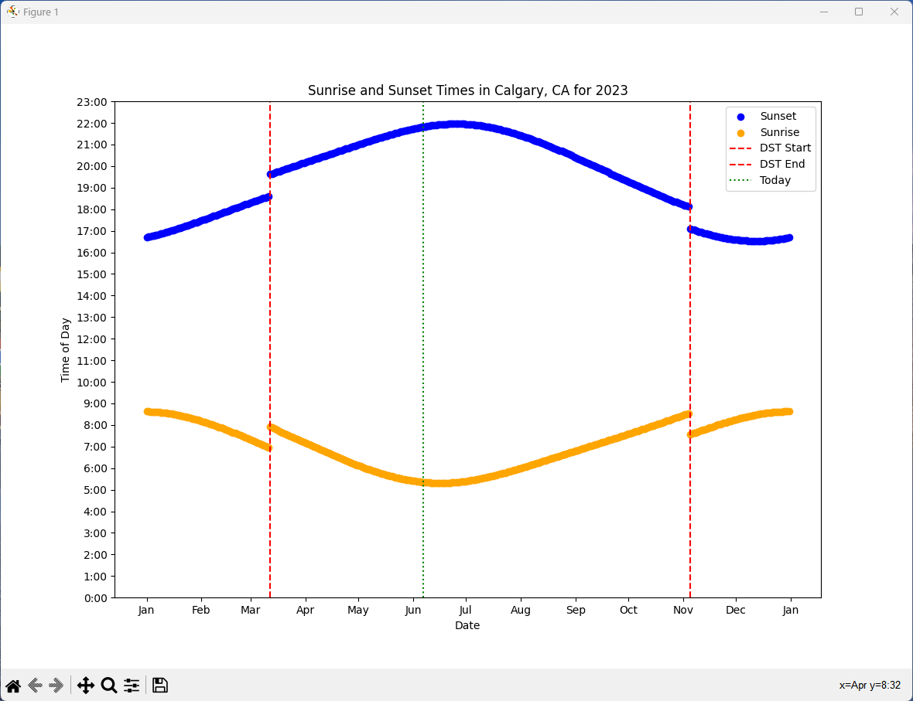

# Sunrise-Sunset Visualization, version 1.0

## Changes:
- Time zone adjusted using GeoNames API and a new module
- In locations where there is no daily sunset or sunrise for parts of the year, nothing should be plotted (near the pole regions. Not tested yet but new code is there)
- The API calls to obtain sunset/sunrise data are too fast and may trigger an API limit error (slowed API calls)
- Reduced size of plot graph points so individual days are clear
- Move changeable data to the DATA directory
- Not tested thoroughly yet...

## Description

Gathers and visualizes data on sunrise and sunset times throughout the year for a given city. The data is gathered from the API provided by sunrise-sunset.org and visualized using matplotlib. Uses fuzzy searching to narrow down the correct City from the user's input.

## How to Run

1. Clone the repository to your local machine.
2. Navigate to the project directory.
3. Run the main script by typing `python main.py` in your terminal.
4. If running for the first time, you will be prompted to select a city. The city data will be saved and reused for future runs. If you want to visualize a different city, then delete the `city.json` and `collected_sun_data.py` files. Just delete the contents of the DATA directory.
5. The script will collect sunrise and sunset data for the selected city for the current year. This process will take about 12 minutes.
6. Once the data is collected, a visualization will be displayed. You can maximize the visualization and export/save it.

## Example Output

Here is an example of a visualization for Calgary, Alberta:

